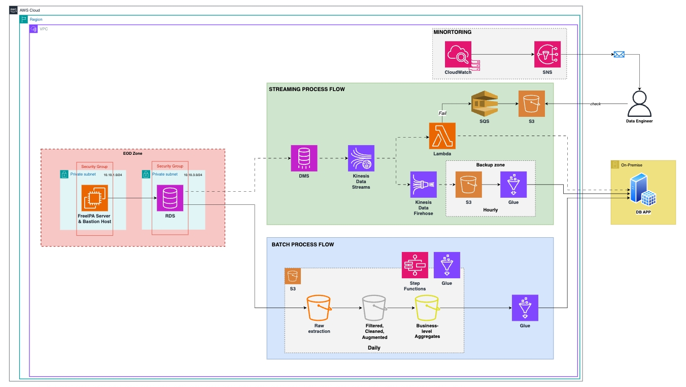

# group-69-ssis-migration-to-aws

## Mục tiêu

Dự án này mô phỏng quy trình **migrate SSIS ETL pipeline lên AWS** sử dụng các dịch vụ serverless hiện đại như AWS Glue, Kinesis, Lambda, S3, DMS, Step Functions, v.v.  
Hệ thống hỗ trợ ingest, transform, kiểm tra chất lượng và nạp dữ liệu từ nhiều nguồn (file, database, API) lên AWS, đồng thời đảm bảo khả năng mở rộng, tự động hóa và giám sát.

---

## Kiến trúc tổng quan




- **Batch ETL**: Các Glue Job thực hiện collect, transform, quality check và load dữ liệu theo batch.
- **Streaming**: Dữ liệu thay đổi (CDC) được đẩy lên Kinesis, xử lý real-time qua Lambda, ghi vào database.
- **Orchestration**: Step Functions điều phối các Glue Job theo pipeline.
- **IaC**: Toàn bộ hạ tầng được quản lý bằng Terraform.

---

## Thành phần chính

- **batch/**: Source code cho các Glue Job (collector, transformer, loader, quality checker, accomplisher).
- **streaming/**: Lambda function xử lý dữ liệu từ Kinesis, ghi vào DB, xử lý DLQ.
- **iac/**: Terraform code tạo toàn bộ hạ tầng AWS (VPC, RDS, Glue, Kinesis, Lambda, S3, DMS, Step Functions, IAM, ...).
- **docker-compose.yaml**: Môi trường local gồm Glue local, MySQL, Postgres, MinIO để phát triển và test.

---

## Dịch vụ AWS sử dụng

- **AWS Glue**: Chạy các ETL Job (collect, transform, load, quality check).
- **AWS Kinesis Data Stream & Firehose**: Streaming dữ liệu thay đổi.
- **AWS Lambda**: Xử lý record từ Kinesis, ghi vào DB, xử lý DLQ.
- **Amazon RDS (Postgres)**: Lưu trữ dữ liệu.
- **Amazon S3**: Lưu trữ data zone (landing, staging, silver, gold), backup, artifacts.
- **AWS DMS**: CDC từ RDS lên Kinesis.
- **AWS Step Functions**: Orchestrate pipeline.
- **Amazon SQS**: Dead Letter Queue cho Lambda.
- **IAM, VPC, Security Group, ...**: Bảo mật và mạng.

---

## Hướng dẫn chạy local (phát triển)

1. **Clone repo**
2. **Chạy docker compose**
   ```bash
   docker-compose up -d
   ```
   - Chạy Glue local, MySQL, Postgres, MinIO.
3. **Phát triển Glue Job**: Mount code vào container Glue local.
4. **Test với sample data**: Sử dụng các file `.csv` hoặc script trong `batch/sample_artifacts/` (nếu có).

---

## Hướng dẫn triển khai hạ tầng AWS

1. **Cài đặt Terraform**
2. **Cấu hình AWS CLI với quyền phù hợp**
3. **Triển khai**
   ```bash
   cd iac
   terraform init
   terraform apply
   ```
4. **Upload code/layer lên S3 nếu cần**

---

## Orchestration & Data Flow

- **Batch**: Glue Job collect dữ liệu từ nguồn (file, DB, API) → S3 landing → transform → quality check → load vào RDS hoặc S3 zone tiếp theo.
- **Streaming**: DMS CDC → Kinesis → Lambda xử lý → ghi vào DB → lỗi gửi vào SQS DLQ → Lambda DLQ handler backup lên S3.

---

## Đóng góp

- Fork, tạo branch, PR như thông lệ.
- Mọi góp ý, bug, feature request vui lòng tạo issue.

---

## License

MIT (hoặc cập nhật theo dự án của bạn)
